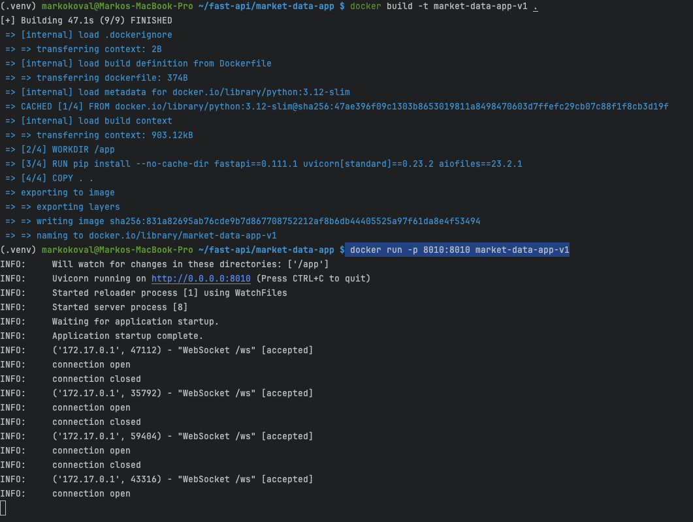
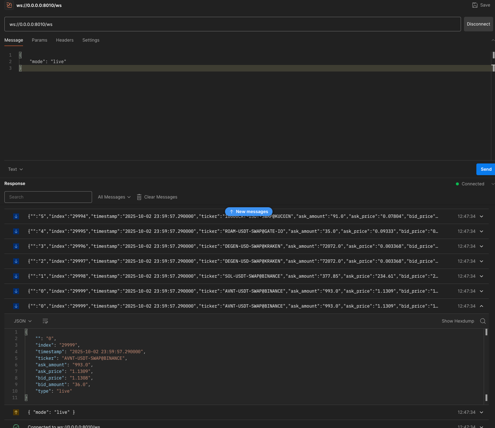
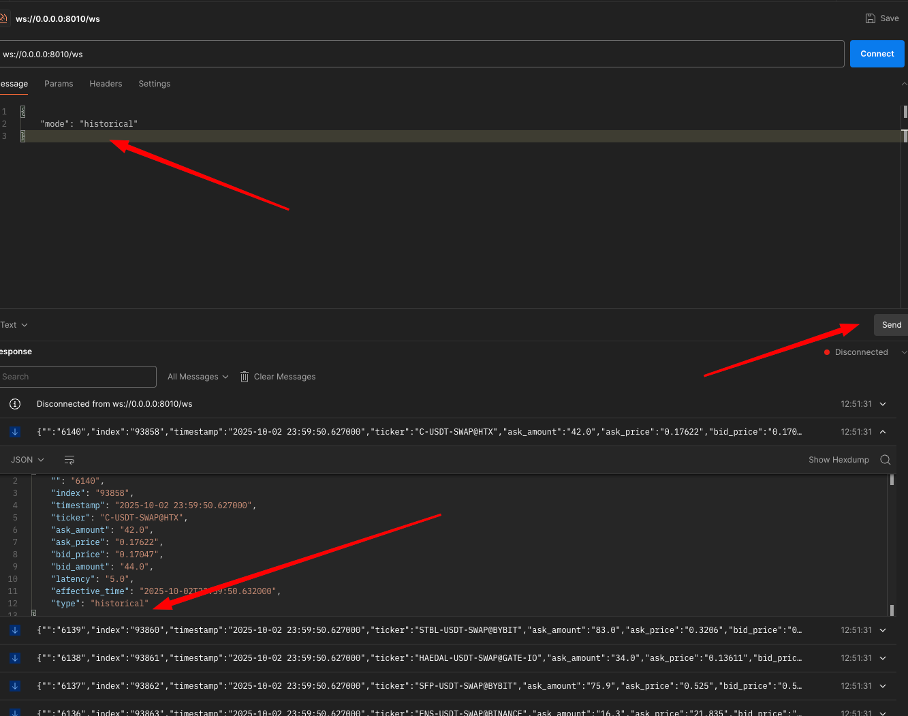

**TO RUN MARKET DATA APP HAVE DOCKER SETUP ON YOUR SYSTEM**

1. docker build -t market-data-app-v1 .

2. docker run -p 8010:8010 market-data-app-v1

3. Open Postman to connect websockets via `ws://0.0.0.0:8010/ws`

it is possible to switch between `historical` and `live` mode

4. Suggestion: It may be implemented Caching also to improve performance for all clients